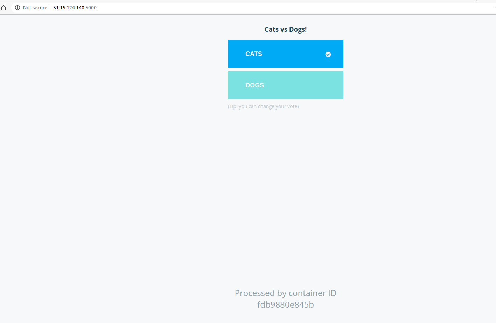

Example Voting App
=========



```
sudo docker ps
CONTAINER ID        IMAGE               COMMAND                  CREATED             STATUS              PORTS                    NAMES
55d11ed2968f        worker-app          "java -jar target/wo…"   23 minutes ago      Up 23 minutes                                stoic_pare
aef1c360e74b        postgres:9.4        "docker-entrypoint.s…"   27 minutes ago      Up 27 minutes       5432/tcp                 db
fdb9880e845b        voting-app          "gunicorn app:app -b…"   34 minutes ago      Up 34 minutes       0.0.0.0:5000->8080/tcp   hardcore_faraday
872ccd18a890        redis               "docker-entrypoint.s…"   55 minutes ago      Up 55 minutes       6379/tcp                 redis

```


Getting started
---------------

Download [Docker](https://www.docker.com/products/overview). If you are on Mac or Windows, [Docker Compose](https://docs.docker.com/compose) will be automatically installed. On Linux, make sure you have the latest version of [Compose](https://docs.docker.com/compose/install/).

Run in this directory:
```
docker-compose up
```
The app will be running at [http://localhost:5000](http://localhost:5000), and the results will be at [http://localhost:5001](http://localhost:5001).

Alternately, if you want to run it on a [Docker Swarm](https://docs.docker.com/engine/swarm/), first make sure you have a swarm. If you don't, run:
```
docker swarm init
```
Once you have your swarm, in this directory run:
```
docker stack deploy --compose-file docker-stack.yml vote
```

Architecture
-----


* A Python webapp which lets you vote between two options
* A Redis queue which collects new votes
* A .NET worker which consumes votes and stores them in…
* A Postgres database backed by a Docker volume
* A Node.js webapp which shows the results of the voting in real time


Note
----

The voting application only accepts one vote per client. It does not register votes if a vote has already been submitted from a client.
